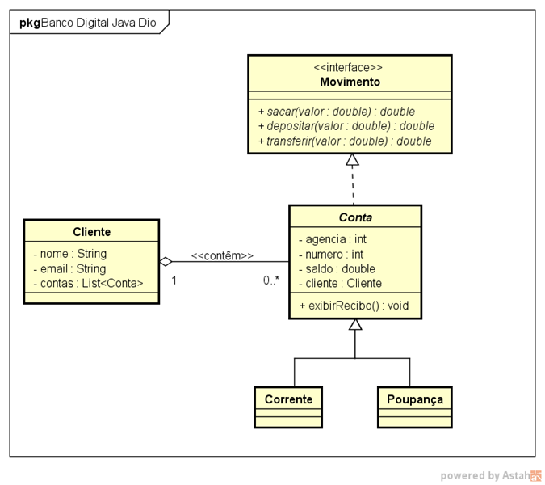
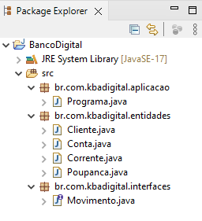

# Projeto GFT Start #3 Java

## Banco Digital
### Java

#### Projeto desenvolvido através da abstração de objetos do mundo real de um banco. 

#### Primeiramente criei um modelo da UML para demonstrar como fica a organização de classes no programa.

#### O desenvolvimento do código foi realizado no Eclipse.

https://www.eclipse.org/downloads/

#### A organização das classes é por pacotes de acordo com suas finalidades.

#### A organização ficou da seguinte forma:

1. Pacote 1 - aplicação
2. Pacote 2 - entidades
3. Pacote 3 - interfaces

#### O programa foi feito através de solicitações de dados digitados e um contador, para realizar a quantidade desejada de informações.
